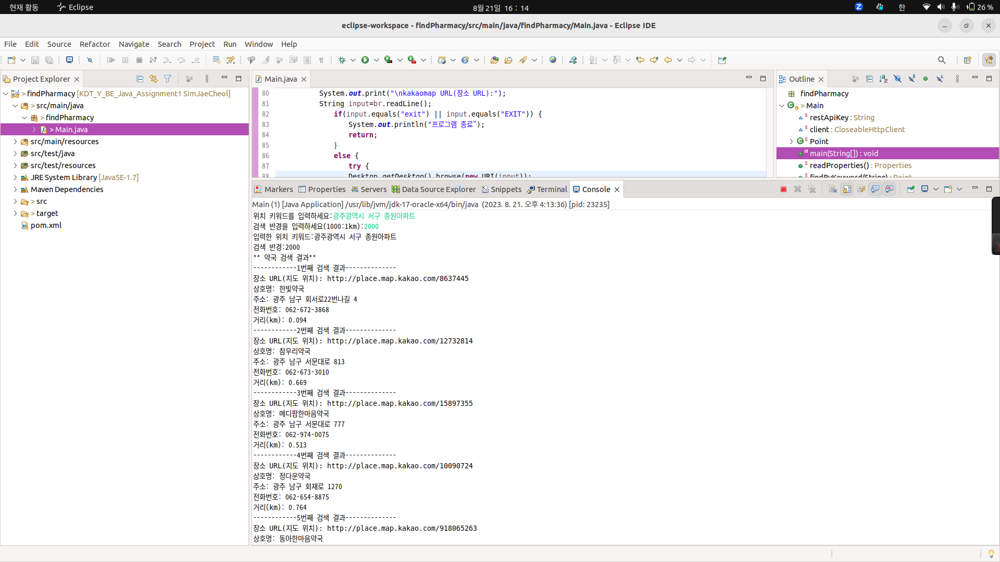
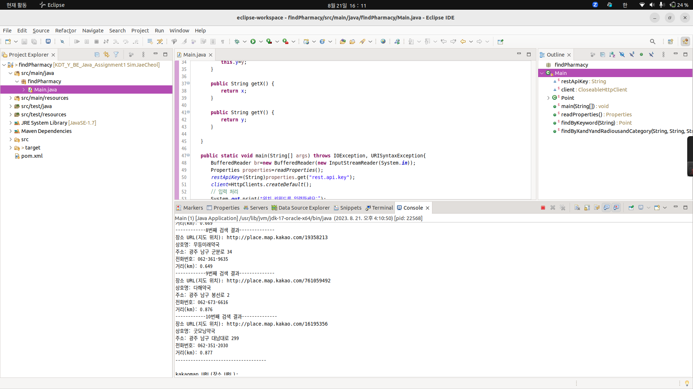
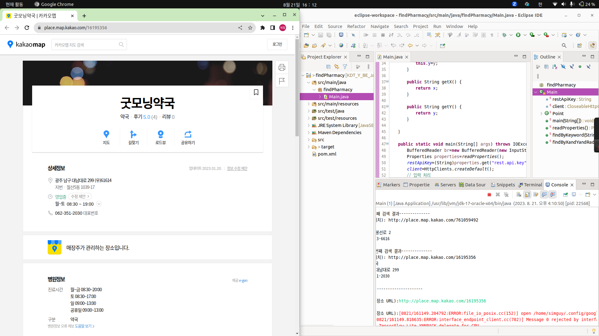
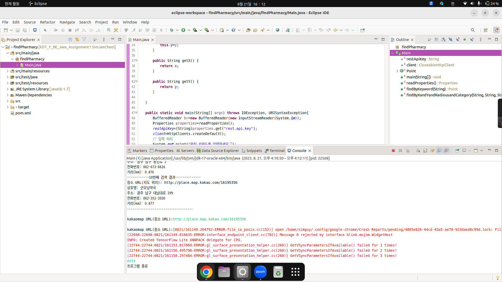

# 🧑‍⚕️주변 약국 찾기 (Java Application)
   
   
    특정 위치(키워드) 주변의 지정된 반경 내에서 약국을 검색하는 Java 어플리케이션입니다.

## 1. 필수 요구 사항

 * 카카오 오픈 API 활용
 
 * [로컬 REST API 문서](https://developers.kakao.com/docs/latest/ko/local/dev-guide)를 참고하여 `키워드로 장소 검색`하기와 `카테고리로 장소 검색하기`을 활용하여 개발

## 2. 프로그램 사용 설명서 
1. 키보드로 특정 위치 키워드와 검색 반경을 입력합니다.

3.  상위  `10개 결과에 대한 추출된 데이터를 표시`합니다.

5.  검색된 결과에서 장소 URL을 입력하면 브라우저에 해당 kakaomap이 출력되도록 한다.

7. exit를 입력하면 종료한다.

