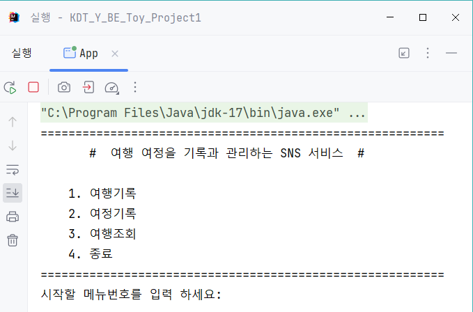
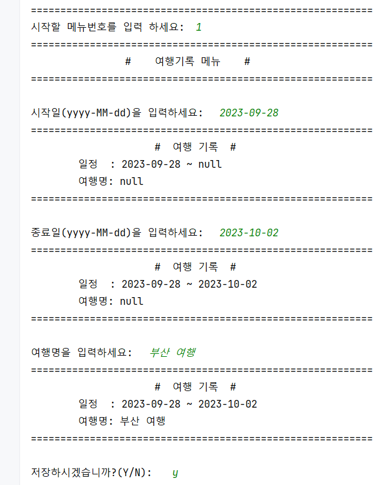
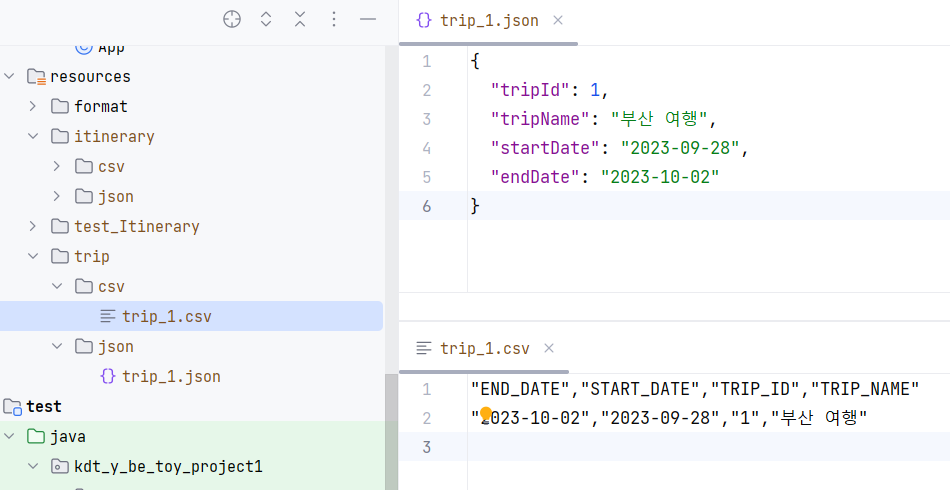
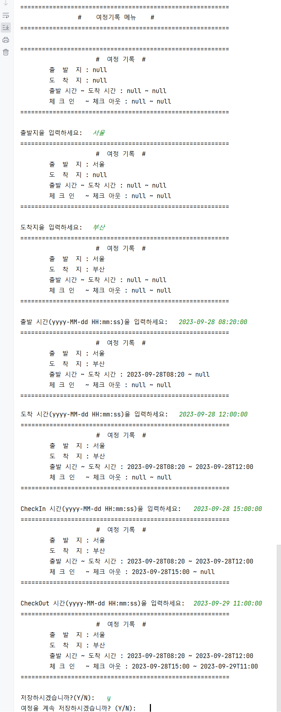
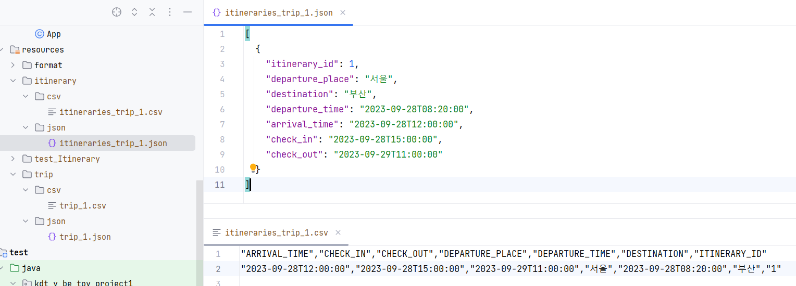
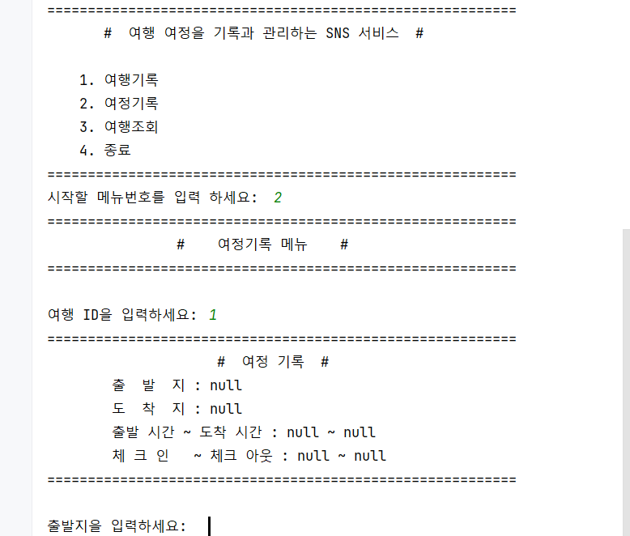
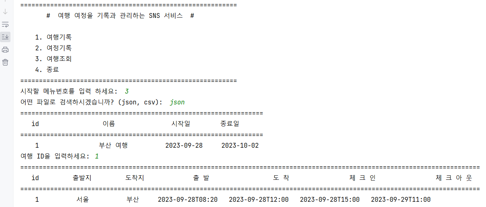
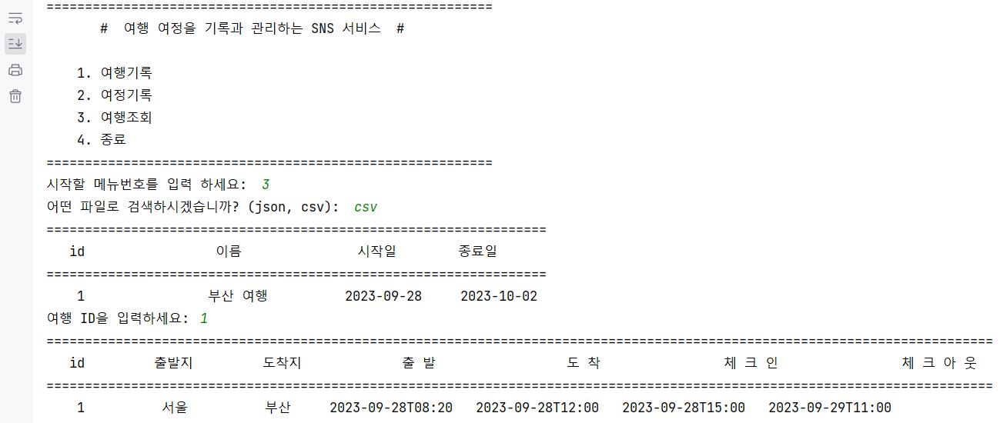
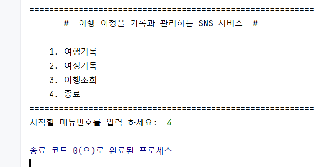

# 🎢 실행화면

## 목차

1. [여행 기록](#1-여행-기록)
2. [여정 기록](#2-여정-기록)
3. [여행 저장](#3-여행-조회)
4. [종료](#4-종료)

## 메인화면

## 1. 여행 기록

### 여행 기록

### 여행 기록 -> 여행 저장

### 여행 저장 -> 여정 기록

### 여정 기록 -> 여정 저장

## 2. 여정 기록

### 여정 기록 ~ 여정 저장

위 여행 기록의 [여행 저장 -> 여정 기록](#여행-저장---여정-기록) 부분과 동일하기 때문에 생략했습니다.

## 3. 여행 조회

1. 모든 여행 목록을 출력합니다.
2. 사용자가 여행 ID를 입력하면,
3. 해당 여행에 있는 모든 여정을 출력합니다.

### 여행 조회 (JSON 파일)

### 여행 조회 (CSV 파일)

## 4. 종료

